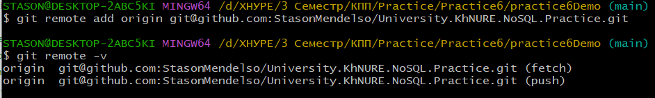
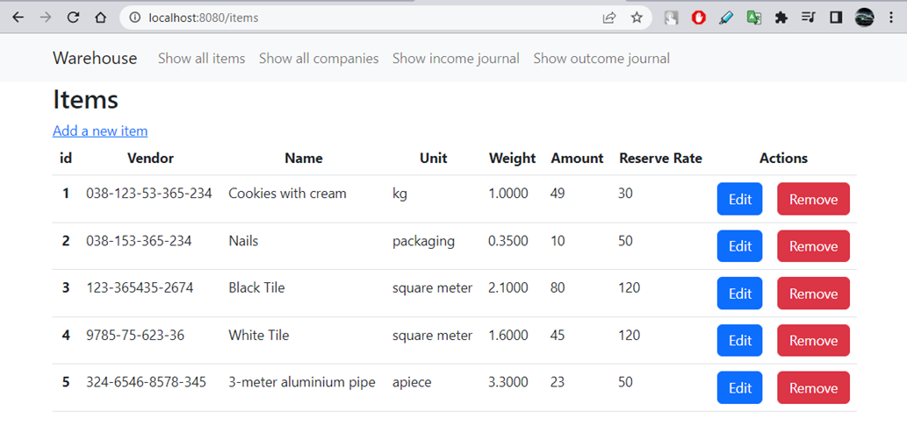
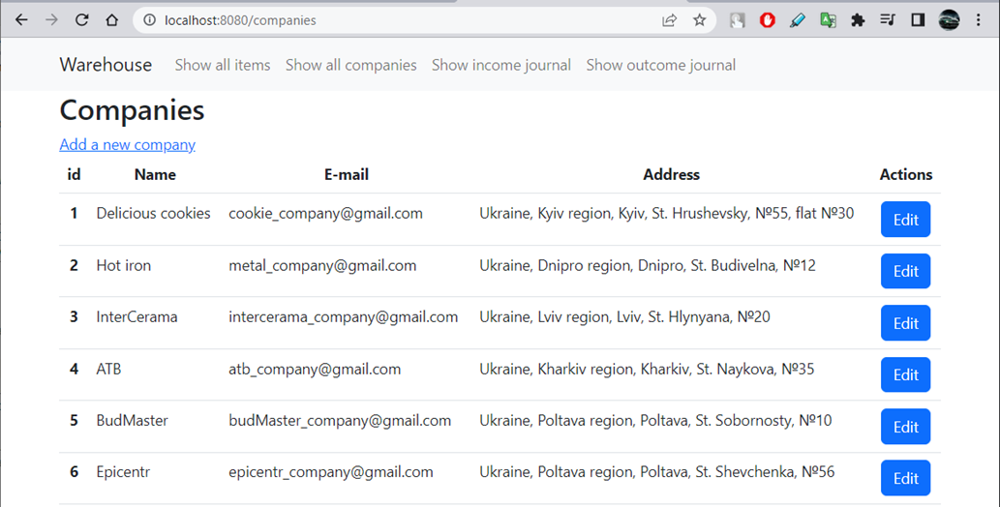
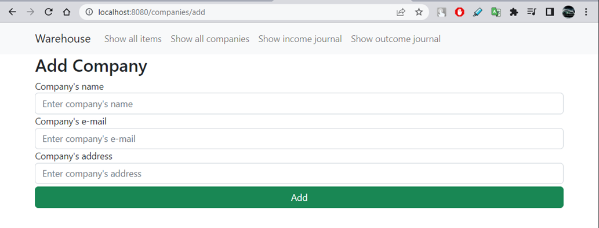
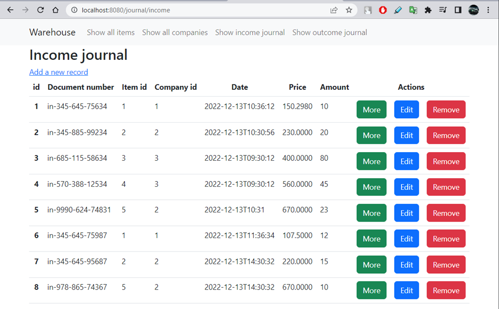
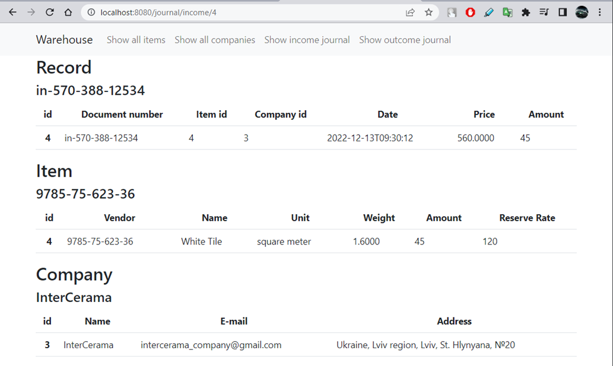
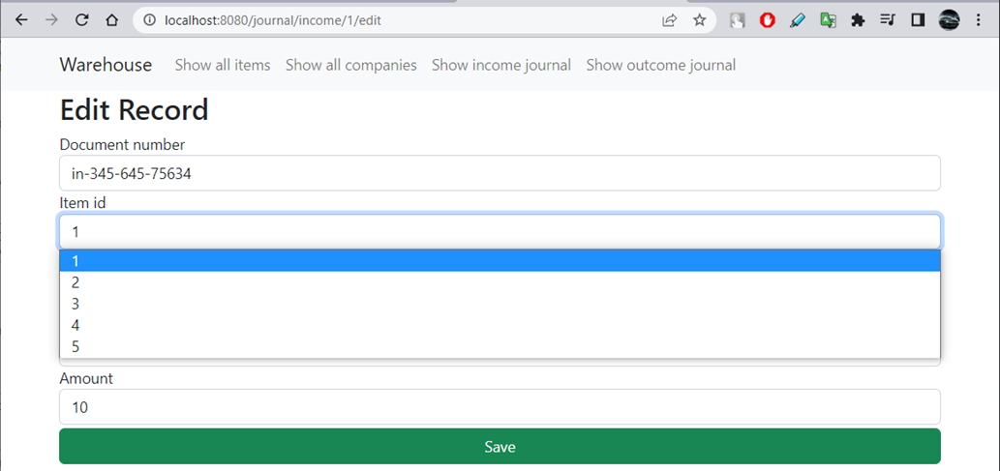
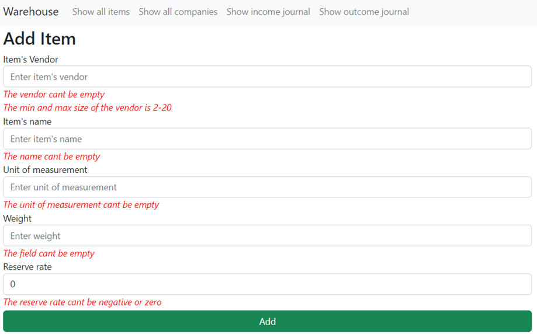
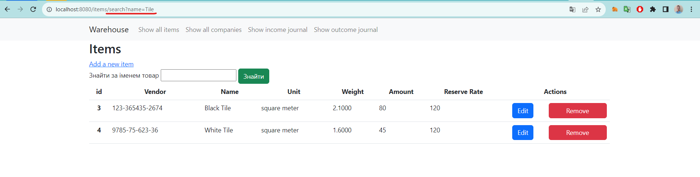

# University.KhNURE.NoSQL.Practice

## What is the project about?

Repository is for educational purpose - implementing practical tasks on the discipline *"NoSQL Databases"* in
the university "[Kharkiv National University of Radio Electronics][1]".

## What is the purpose of this project?

The **purpose** of the project is ***implementing simple web-application*** (warehouse),using a relational DB as a
database first, and then switch to NoSQL(MongoDB).

## Getting Started

There is a web-application which represents a business processes in the warehouse.
For running the app you need to download the latest version from the **main** branch and configure the web-server (*if
it's needed*), the database and connection to it. Follow the next chapters.

### Prerequisites

For running the project you need the next:

* [MySQL Community Server 8.0.33](https://dev.mysql.com/) - for running the app with database. Also, you can use another
  database.
  You can find the [scripts](database/sql) of [creating](database/sql/creation_database.sql)
  and [adding data](database/sql/adding_data.sql) to the database in directory with name "*[database](database/sql)*".

### Installation Instruction

#### How to download project on my local machine?

For downloading the project locally you can use two variants:

1. Download the ZIP archive from the repository page.

   The method is easy, the next steps helps you:
    1. Find the button `Code` and press it.
    2. Find the button `Download ZIP` and press it. The downloading must start.
    3. Unzip the archive in soe directory and run the IDEA in this directory.

Project has been installed.

2. Use the `Git` for downloading the repository locally.

   The method a lit bit difficult, but the project will be downloaded with the help
   of several commands, and not manually, as in the previous method. For this method
   you **need** to [install][4] the `Git Bash` on your computer, make some configuration and have a primary skill of
   using this system of version control.
    1. Enter your [name][5], [email][6] of GitHub account locally on your machine.
    2. Create an empty directory and initialize it as git repository. Use the next
       command - `git init`.
    3. Adds this repository to yours with name `origin` (you can change it, if you want):
        ```
       $ git remote add origin git@github.com:StasonMendelso/University.KhNURE.NoSQL.Practice.git
       ```
       But you need configure your SSH connection to your GitHub profile in Git Bash. See more [here][7].

       For viewing that the repository has been added successfully to your local
       repository, you need execute the next command and get the following result:
       ```
       $ git remote -v
       ```
       

       After this step your local repository has got a 'connection' to the remote
       project from the GitHub repository.
    4. For downloading the project use the following command:
       ```
       $ git pull origin main
       ```
       After these steps your project directory must contain the project files from
       GitHub repository. In addition to, you can create a new branch, make some
       changes and create a pull request for suggesting your improvements. Also, all
       changes are observed by the `git` and you can always make a rollback of
       all changes `git reset --hard`.

#### What things you need to install the software and how to configure them?

##### Database configuration

For running the database you can use MySQL Server or create your own database on another SQL server
using the [script](database/sql/creation_database.sql) file of creating the database.
<br>
**Note**: if you use another server not such
MySQL you should change JDBC driver for working with it and configurate the connection to your
server in appropriate [property file](src/main/resources/application.properties). If you change driver, you should
make some changes in [pom.xml file](pom.xml)
<br>

##### Server configuration

For running the code you needn't install server and configure it, because the Spring Boot starter
makes it instead of you using the pom.xml.

### Running the web-app

You can find "*application.properties*" for configuration. This file
contains configuration the application using the Spring Boot, so you can put your values to the file and
run
application with this application configuration. You can find more about configuration of Spring Boot application on
the Internet.

For running the app on the server you need only run the main method in Java class. Also, you can
package app to the jar file and deploy the file on the server manually.

## Examples of web-application's pages

Here you can find the screenshots of the web-application:











## Built With

* [Maven](https://maven.apache.org/) - Dependency Management

## Authors

* **Stanislav Hlova** - *All
  work* - [StasonMendelso](https://github.com/StasonMendelso)

[1]:https://nure.ua/

[4]:https://git-scm.com/downloads

[5]:https://docs.github.com/en/get-started/getting-started-with-git/setting-your-username-in-git

[6]:https://docs.github.com/en/account-and-profile/setting-up-and-managing-your-personal-account-on-github/managing-email-preferences/setting-your-commit-email-address

[7]:https://docs.github.com/en/authentication/connecting-to-github-with-ssh
